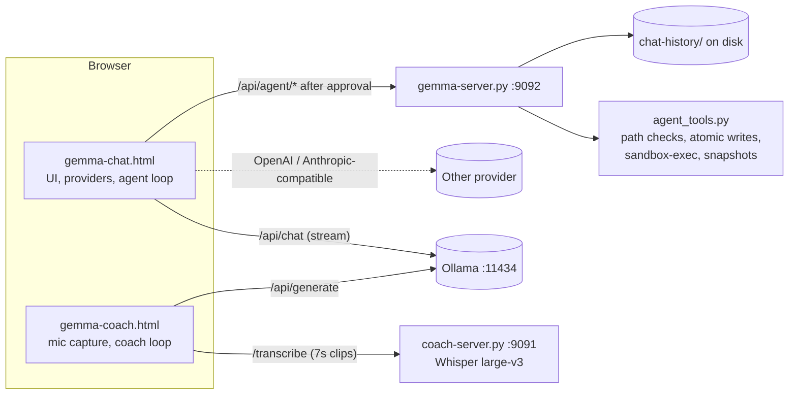

# Gemma4: Local-First Chat, Coding Agent, and Live Coach

Two local-first web apps for models running in Ollama on your own machine: a chat client with a sandboxed, approval-gated coding agent, and a live conversation coach that transcribes your mic locally with Whisper.

 

Each app is one self-contained HTML file plus a small Flask server bound to `127.0.0.1`. No cloud service is needed on the default Ollama path.

| App | Files | Port | What it is |
|-----|-------|------|------------|
| **Gemma Chat** | `app/gemma-chat.html`, `app/gemma-server.py`, `app/agent_tools.py` | 9092 | Chat client + coding agent (read, write, edit, run) |
| **Gemma Coach** | `app/gemma-coach.html`, `app/coach-server.py` | 9091 | Listens to a live conversation and suggests what to say next |

## What it does

- **One client, three backends.** Gemma Chat talks to Ollama, any OpenAI-compatible API (including LM Studio at `localhost:1234`), or an Anthropic-compatible API through one internal message format, so you can switch provider mid-conversation and keep the history. Tool-call arguments that OpenAI streams in index-keyed fragments are reassembled before parsing.
- **Human-in-the-loop coding agent.** The model can list and read files freely; every write, edit, and shell command shows up as a diff or command card and does nothing until you approve it. The loop stops after a configurable iteration cap (default 8).
- **Sandboxed execution.** Approved commands run under macOS `sandbox-exec` with a profile that denies writes outside the project root and denies network access. Paths are resolved (symlinks included) before the containment check, writes are atomic with a backup of the previous file, and the project is zip-snapshotted before each command (skipped above 100 MB).
- **Client-side context management.** Opening turns and the recent tail are pinned, the middle is filled to a token budget, and older turns are summarized in the background once the prompt passes 60% of the model's context window. Also: a Judge/Solver reflect loop (default 5 rounds, pass score 80), native or prompted "thinking", markdown, math, Mermaid, Plotly, and a live HTML/SVG preview panel.
- **Gemma Coach.** Records the mic in 7-second clips, transcribes each with local Whisper `large-v3`, and drops hallucinated text with two gates: an RMS silence check before the model, and per-segment no-speech, log-probability, and compression-ratio thresholds after it. The recent transcript plus your talking points go to `gemma4:e4b` for suggestions.

## Architecture



All app logic (rendering, providers, context assembly, the tool loop) lives in the HTML files. The Python servers only do what a browser cannot: Gemma Chat's server serves the page, stores chat history atomically with rolling backups, and runs the agent's file and shell tools; Gemma Coach's server runs Whisper. The agent's project root is stored and validated server-side; the browser copy is only a cache. More detail in [docs/ARCHITECTURE.md](docs/ARCHITECTURE.md).

## Quickstart

Requirements: macOS (agent shell commands need `sandbox-exec`; the rest works elsewhere), Python 3.10+, [Ollama](https://ollama.com), and `ffmpeg` for Gemma Coach (`brew install ffmpeg`).

```bash
git clone https://github.com/DevSoVague/gemma4-local-agent.git
cd gemma4-local-agent
python3 -m venv .venv && source .venv/bin/activate
pip install -r requirements.txt     # Chat alone only needs: pip install flask
```

Pull models:

```bash
ollama pull gemma4:e4b      # model Gemma Coach uses (hardcoded in gemma-coach.html)
```

Gemma Chat lists whatever models your Ollama has installed, so any chat model works. The launcher menu (`launch-gemma.sh`) offers `qwen3.8-27b`, `qwen3.8-27b-abliterated` (Ollama), and `qwen3.8-27b-mlx` (LM Studio); edit the `case` block near the top of the script to use your own tags.

**Run Gemma Chat** (starts Ollama if needed, warms the model, starts the server, opens `http://localhost:9092/`):

```bash
bash app/launch-gemma.sh
```

**Run Gemma Coach** (opens `http://localhost:9091/gemma-coach.html` once Whisper has loaded; the first run downloads the `large-v3` weights):

```bash
bash app/launch-coach.sh
```

**Stop everything** (unloads models, stops Ollama, LM Studio, and the page server): `bash app/stop-gemma.sh`.

Environment variables (all optional, no secrets): `PYTHON` picks the interpreter the launchers use (default: `python3` from the active venv); `CONDA_ENV` makes `launch-coach.sh` activate a conda env instead; `WHISPER_MODEL` swaps Gemma Coach's Whisper model (default `large-v3`; `small.en` or `tiny.en` start much faster on smaller machines). API keys for remote providers are entered in the Chat UI, not in files. To use the agent, enable Agent mode in Chat settings and paste an absolute project path.

## Data

There is no dataset. Model weights come from Ollama (`ollama pull`) and from Whisper on first run (cached by `openai-whisper`). Runtime state stays local and is git-ignored: `app/chat-history/`, `app/agent_config.json`, and a `.gemma_agent/` folder (backups, snapshots) inside whatever project you point the agent at.

## Results

No benchmark results; this is an application, not a model. Fixed settings from the code:

| Setting | Value | Where |
|---------|-------|-------|
| Agent iteration cap (default) | 8 | `gemma-chat.html` `agentConfig.maxIter` |
| Shell command timeout | 30 s | `gemma-server.py` `RUN_TIMEOUT_DEFAULT` |
| Pre-run snapshot size cap | 100 MB | `agent_tools.py` `SNAPSHOT_SIZE_CAP` |
| Background summary trigger | 60% of context | `gemma-chat.html` `summaryThreshold` |
| Chat history backups kept | 20 | `gemma-server.py` `HISTORY_BACKUPS` |
| Coach clip length | 7 s | `gemma-coach.html` `CHUNK_MS` |
| Whisper gates | RMS < 0.008, P(no speech) > 0.6, logprob < -1.0, compression > 2.4 | `coach-server.py` |

## Project structure

```
gemma4-local-agent/
├── app/
│   ├── gemma-chat.html       # Chat app: UI, providers, context, agent + reflect loops
│   ├── gemma-server.py       # Flask: serves Chat, /api/agent/*, /api/sessions
│   ├── agent_tools.py        # path containment, atomic writes, sandbox profile, snapshots
│   ├── gemma-coach.html      # Coach app: mic capture, transcript, suggestions
│   ├── coach-server.py       # Flask + Whisper: /transcribe
│   ├── launch-gemma.sh       # start Chat (Ollama or LM Studio)
│   ├── launch-coach.sh       # start Coach
│   ├── stop-gemma.sh         # stop everything
│   └── Gemma Chat.command    # double-click launcher for macOS Finder
├── docs/                     # architecture, workflows, user guide, full feature reference
├── requirements.txt
└── LICENSE
```

Further reading: [REFERENCE.md](docs/REFERENCE.md) (full feature list), [HOW_TO_USE.md](docs/HOW_TO_USE.md), [CHAT_AGENT_WORKFLOW.md](docs/CHAT_AGENT_WORKFLOW.md), [REFLECT_WORKFLOW.md](docs/REFLECT_WORKFLOW.md), [PROJECT_TOUR.md](docs/PROJECT_TOUR.md).

## Team & credits

Solo personal project by Devavrath Sandeep. Not tied to a course. Uses Ollama, OpenAI Whisper, Flask, and CDN-loaded highlight.js, pdf.js, JSZip, MathJax, Mermaid, and Plotly.

## License

MIT, see [LICENSE](LICENSE).
