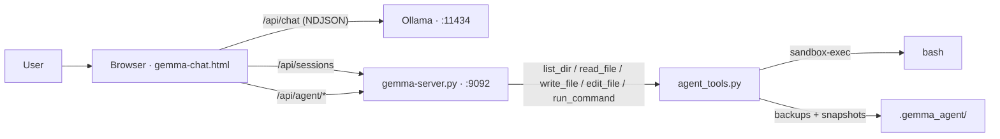
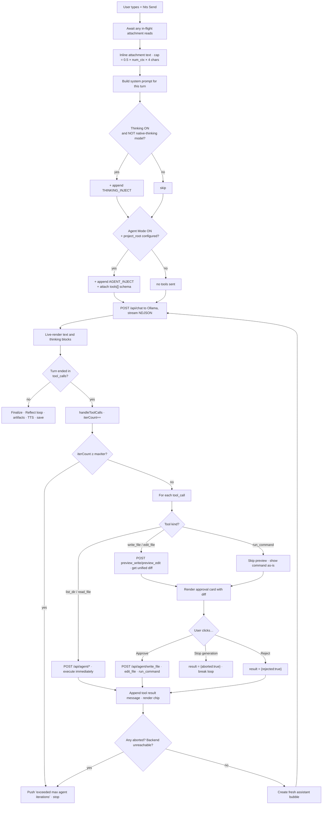

# Gemma Chat - Full Message Workflow (Chat → Gemma Server → Agent Tools)

A step-by-step walkthrough of what actually happens, in order, when one message is sent from
the browser, how it reaches the model through Ollama, and how the agent-tool loop hands
approved file/command actions to `gemma-server.py` + `agent_tools.py`. Written as a workflow,
not a file-by-file reference. For the Reflect / Thinking / TTS side of the same reply see
[`WORKFLOW.md`](WORKFLOW.md), [`REFLECT_WORKFLOW.md`](REFLECT_WORKFLOW.md),
[`THINKING_WORKFLOW.md`](THINKING_WORKFLOW.md), [`TTS_WORKFLOW.md`](TTS_WORKFLOW.md).

---

## The pieces in play

- **Browser page** - [`gemma-chat.html`](../app/gemma-chat.html), a single-page app. Holds all state:
  sessions, system prompt, agent config, approval promises.
- **Ollama** - the model runtime at `http://localhost:11434` (`/api/chat`, `/api/tags`,
  `/api/ps`, `/api/show`). Not part of this repo.
- **Gemma server** - [`gemma-server.py`](../app/gemma-server.py), a Flask app on **port 9092**. Serves
  the HTML page and exposes `/api/sessions` (chat history) and `/api/agent/*` (file + sandbox
  tools). It does **not** proxy Ollama - the browser talks to Ollama directly.
- **Agent tools** - [`agent_tools.py`](../app/agent_tools.py), a pure-Python module the server imports
  for path-safe file ops, backups, project snapshots, and `sandbox-exec` command execution.



---

## The full journey, one message



---

## Numbered steps

1. **User hits Send.** [`sendMessage()`](../app/gemma-chat.html#L2867) refuses re-entry while
   `isLoading`, then awaits any in-flight FileReader / pdf.js / JSZip attachment reads -
   otherwise the message would be sent without the file the user just attached.
2. **Attachment text is inlined and capped.** Each attachment is turned into
   `` [File: name] ``\`\`\`...content...\`\`\` `` and appended to the user's typed text. The
   combined attachment text is clipped so it can't exceed **50 %** of `num_ctx × 4` chars
   (`attBudgetChars` at [`gemma-chat.html:2900`](../app/gemma-chat.html#L2900)). Images go to Ollama's
   `images[]` field, but **only for the Ollama provider** - image attachments on OpenAI/
   Anthropic backends are dropped with a toast, not silently sent as invalid payloads.
3. **A neutral message array is built** from session history
   ([`buildNeutralApiMessages`](../app/gemma-chat.html#L2292)). Middle turns are evicted first once
   estimated tokens cross `MEM_CONFIG.windowThreshold × num_ctx`; recent turns and the first
   two user turns ("task anchor") are always kept.
4. **The system prompt is assembled** in [`runChatTurn`](../app/gemma-chat.html#L2965) starting from
   the editable `systemPrompt` (default: `DEFAULT_SYSTEM_PROMPT`, the block at
   [`gemma-chat.html:1295-1379`](../app/gemma-chat.html#L1295-L1379) that establishes markdown /
   image / SVG-artifact / download-fence / mermaid / plotly / LaTeX conventions). Two things
   may be appended:
   - `THINKING_INJECT` - only if `thinkingEnabled` and the model does **not** advertise native
     thinking capability. Injecting this into a native reasoner makes it reason twice.
   - `AGENT_INJECT` - only if `agentConfig.enabled && agentConfig.projectRoot`.
5. **If agent mode is active, `buildAgentTools()` is called** and its result is attached as
   the request's `tools` field. `list_dir` / `read_file` / `write_file` / `edit_file` are
   always present; `run_command` is added only if `agentConfig.allowRun` is on.
6. **The request is dispatched.** For Ollama, [`streamOllama`](../app/gemma-chat.html#L2532) POSTs to
   `http://localhost:11434/api/chat` with `stream:true` and NDJSON is read line-by-line.
   `evt.message.content` → live answer, `evt.message.thinking` → live reasoning block,
   `evt.message.tool_calls` → **overwritten** (not accumulated - Ollama sends the full array in
   one line, verified live).
7. **When the stream is done**, if `toolCallsAccum` is empty the turn is finalized: Reflect loop
   runs (if enabled), artifacts are extracted from the FINAL text, action buttons are wired,
   auto-TTS fires. **Order matters** - Reflect replaces the answer, and doing artifacts / TTS
   first meant speaking and extracting from the discarded draft.
8. **If `tool_calls` came back and agent mode is on**, control goes to
   [`handleToolCalls`](../app/gemma-chat.html#L3317) instead. The assistant's tool-calls turn is pushed
   to session history, then each call is executed sequentially by `executeOneToolCall`.
9. **Read-only tools (`list_dir`, `read_file`) run without a prompt.** They just POST to
   `/api/agent/list_dir` or `/api/agent/read_file` on the gemma server and the response is
   pushed as a tool-result message and rendered as a collapsed chip.
10. **Write tools (`write_file`, `edit_file`) always go through a preview first.** The browser
    POSTs to `/api/agent/preview_write` or `/api/agent/preview_edit`, which returns a unified
    diff computed by `agent_tools._unified_diff()` - **no disk write happens**. The diff is
    rendered in an approval card with Approve / Reject buttons. Only after the user clicks
    **Approve** does the browser POST to the corresponding apply endpoint.
11. **`run_command` skips the preview** (there is nothing to diff) and shows the literal
    command string in the approval card, badged `sandboxed - no network, no writes outside
    project`. Approve → POST to `/api/agent/run_command` with the current
    `agentConfig.preRunSnapshot` flag.
12. **Server-side, every `/api/agent/*` handler calls `_require_root()` first**
    ([`gemma-server.py:180`](../app/gemma-server.py#L180)) and 404-in-spirit's if no project root is
    configured in `agent_config.json`. Every path also goes through
    [`resolve_safe_path`](../app/agent_tools.py#L28) which refuses absolute paths, `~`, backslashes,
    null bytes, `..` traversal, symlink escape (via `Path.resolve()` before containment check),
    and the reserved `.gemma_agent/` subtree.
13. **A `write_file` apply takes a backup first** into
    `.gemma_agent/backups/<rel>/<name>.<ts>.bak`, then does an atomic
    write-to-temp-then-rename. `edit_file` **re-validates `old_string`** at apply time - if the
    file has changed between preview and Approve, the apply is refused (`"old_string no longer
    matches - file changed since preview; ask the model to re-read and retry"`), not silently
    applied to a different file.
14. **A `run_command` apply may first snapshot the whole project** into
    `.gemma_agent/snapshots/pre-run-<ts>.zip` (skipped if the tree exceeds `SNAPSHOT_SIZE_CAP`),
    then runs the command under `sandbox-exec` with the seatbelt profile from
    [`build_sandbox_profile`](../app/agent_tools.py#L213). The command runs `cwd=project_root`,
    timeout capped at `min(request, MAX_TIMEOUT_S=300)` seconds, stdout/stderr each capped at
    `MAX_OUTPUT_BYTES = 20_000` bytes with a `stdout_truncated` / `stderr_truncated` flag.
15. **The tool result is pushed as a `role:'tool'` message** with `tool_call_id` matching the
    original call, and rendered as a chip in the transcript.
16. **The loop recurses.** A fresh assistant bubble is created and `runChatTurn` runs again
    with `iterCount+1` and the same `originalUserText`. It stops when the model produces prose
    without tool_calls, or when `iterCount >= agentConfig.maxIter` (default **8**), or when an
    approval is Stopped, or when the agent backend is unreachable.
17. **Chat history is persisted server-side.** On every `saveSessions()` the whole sessions
    map is POSTed to `/api/sessions`, which does an atomic
    write to `chat-history/sessions.json` plus a rolling snapshot into
    `chat-history/backups/` (keeps the last **20**, older ones pruned). This is the only
    persistence - the browser's `localStorage` copy is a cache that
    [`syncSessionsFromServer`](../app/gemma-chat.html#L1510) reads back on load.

---

## Injection points - exact text, verbatim

### `DEFAULT_SYSTEM_PROMPT` - [`gemma-chat.html:1295-1379`](../app/gemma-chat.html#L1295-L1379)

Establishes markdown / image analysis / SVG artifact / download-fence / mermaid / plotly /
LaTeX conventions. The literal opening line:

> `You are a helpful, knowledgeable assistant running locally via Ollama. You have full markdown support and multimodal vision capabilities.`

The prompt also declares two fence tags the parser later relies on:

- `` ```<lang> download:<filename.ext> `` → rendered as a download card by `extractDownloads`.
- `` ```<lang> artifact:<title> `` → registered by
  [`extractAndRegisterArtifacts`](../app/gemma-chat.html#L3488) into the artifact panel.

If the prompt is edited from Settings, the new text is stored in `localStorage` under
`gemma_sysprompt` and used for every subsequent turn in the session.

### `AGENT_INJECT` - [`gemma-chat.html:1958`](../app/gemma-chat.html#L1958)

Appended verbatim to the system prompt whenever agent mode is active:

> `\nAGENT TOOLS: You have file tools scoped to a project root the user has explicitly configured. Before calling write_file, edit_file, or run_command, first state a short plan in plain prose (outside of any tool call): which file(s)/command, what change, and why. Use list_dir to explore before assuming where something lives, and read_file before editing if you're not certain of the exact current content - edit_file requires old_string to match exactly and uniquely. Every write_file/edit_file/run_command call requires the user's explicit approval in the UI before anything touches disk or executes; if the user rejects a proposed change, do not repeat the identical call - ask what they'd like instead. run_command output (stdout/stderr) is truncated and the command cannot reach the network or write outside the project root.`

### Tool schema - [`buildAgentTools()`](../app/gemma-chat.html#L1946)

Sent as the request's `tools` field on every turn while agent mode is on. Each function's
verbatim `description`:

| name | description |
| --- | --- |
| `list_dir` | `List files and folders in a directory inside the project root. Use '' or '.' for the root.` |
| `read_file` | `Read a text file's contents (relative to the project root). Large files are truncated.` |
| `write_file` | `Create a new file or fully overwrite an existing one. Requires explicit user approval before it takes effect - this call does NOT write immediately.` |
| `edit_file` | `Replace one exact, unique occurrence of old_string with new_string in an existing file. old_string must match the file's current content exactly, including whitespace, and must be unique. Requires explicit user approval before it takes effect.` |
| `run_command` *(only if `allowRun`)* | `Run a shell command sandboxed to the project root: no network access, no writes outside the project. Requires explicit user approval before it runs. Output is truncated.` |

### `THINKING_INJECT` - [`gemma-chat.html:1929`](../app/gemma-chat.html#L1929)

Prepended only when `thinkingEnabled` **and** the model has no native thinking capability:

> `\nIMPORTANT: Before answering, reason through the problem step-by-step inside <think>...</think> tags. Show your full reasoning process. Then provide your final answer OUTSIDE the tags. Example:`

Native-thinking models (detected via Ollama's `/api/show` capabilities) instead receive the
per-request `think: <level | true | false>` field on `/api/chat`.

### Ollama request body - [`streamOllama`](../app/gemma-chat.html#L2532)

Every turn sends:

```json
{
  "model": "<selected>",
  "messages": [{"role":"system","content":"<sysContent>"}, ...neutralMessages],
  "stream": true,
  "options": {
    "temperature": 0.7, "top_p": 0.9, "top_k": 40,
    "repeat_penalty": 1.1, "num_predict": 8192, "num_ctx": 32768
  },
  "tools": [ ...buildAgentTools() ],
  "think": "medium" | true | false
}
```

with the `options` values coming from `genParams` (defaults are literal above), `tools` present
only in agent mode, and `think` present only for thinking-capable models.

---

## Gotchas

- **`num_ctx` default is contradictory.** The state initializer sets
  `genParams.num_ctx = 8192` ([`gemma-chat.html:1396`](../app/gemma-chat.html#L1396)) with a comment
  claiming "sized for 24GB unified memory". The Ollama call, the attachment budget, and the
  stats display all use `genParams.num_ctx || 32768` as a fallback. In practice a fresh session
  runs on `8192`, but the boot screen's num_ctx input defaults to `32768` and a saved settings
  value wins over both. If you're wondering why an attachment gets truncated aggressively on a
  fresh install, this is why.
- **`think` must be set explicitly in BOTH directions on native-thinking models.** Omitting the
  field on a native reasoner routes the whole reply into the out-of-band `thinking` field,
  burns the full `num_predict` budget, and returns empty `content` - which looks like "no
  streaming, then a wall of reasoning instead of the answer".
- **Read-only tools bypass the approval card entirely.** `list_dir` and `read_file` are
  considered safe and execute immediately against the project root. A malicious system prompt
  or the model itself can enumerate the whole tree and read any file inside the configured
  root without a click - that's an information-disclosure surface even though nothing is
  written.
- **`edit_file`'s uniqueness re-check runs twice.** Once at `preview_edit` (to build the diff)
  and again at `edit_file` apply (in case the file changed between preview and Approve). An
  external editor touching the same file between the approval card and the click can turn a
  green preview into a rejected apply. The apply error asks the model to re-read and retry,
  which pushes another turn onto the tool loop and consumes an iteration.
- **`agentConfig.projectRoot` in the browser is a CACHE.** The only source of truth is the
  server's `agent_config.json`. [`refreshAgentConfigFromServer`](../app/gemma-chat.html#L3984) is
  what actually validates that the folder exists - trusting the browser value alone would let
  a stale `localStorage` entry point tool calls at a since-deleted directory.
- **Snapshots are skipped silently above 100 MB.** `SNAPSHOT_SIZE_CAP = 100_000_000`
  ([`agent_tools.py:7`](../app/agent_tools.py#L7)). Above that, `run_command` still runs, but the
  `{"ok":false,"skipped":true,"reason":"..."}` snapshot marker is the only sign the safety net
  isn't there - a command that writes outside the write/edit backup path in a big repo is
  unrecoverable via the snapshots vault. Backups made by `write_file` / `edit_file` are
  unaffected; they always happen.
- **Tool-call-only turns delete their assistant bubble.** If the model returns only
  `tool_calls` with no prose and the loop stops there (aborted approval, backend unreachable),
  the bubble is `.remove()`'d - otherwise an empty bubble would sit in the transcript forever
  ([`gemma-chat.html:3199`](../app/gemma-chat.html#L3199)). Fine when the loop continues; visible as a
  disappearing bubble when it doesn't.
- **CORS accepts `null` and `file://` origins.** The page can be opened either from
  `http://localhost:9092/` (served by the Flask app) or straight off disk as
  `file:///…/gemma-chat.html`. The `after_request` hook
  ([`gemma-server.py:70`](../app/gemma-server.py#L70)) explicitly allows `null` and any `file://`
  origin so the disk-launch case can still reach the API. `*` is never allowed - the risk is
  bounded to whatever else on the machine can reach `127.0.0.1:9092`.

---

## Persistence - where every workflow output lives

| Thing | Where | Written by | Notes |
| --- | --- | --- | --- |
| Chat sessions | `chat-history/sessions.json` | `POST /api/sessions` → `_history_write` | Atomic replace + up to 20 rolling snapshots in `chat-history/backups/` |
| Agent project root | `agent_config.json` | `POST /api/agent/config` | Also (re)writes `.gemma_agent/run-sandboxed.sh` as a manual toggle |
| System prompt | `localStorage["gemma_sysprompt"]` | Settings save | Browser-local; not synced to the server |
| Client settings (endpoint, model, provider, params, thinking flags) | `localStorage["gemma_chat_settings"]` | Settings save / Boot Connect | Browser-local |
| File write backups | `.gemma_agent/backups/<rel>/<name>.<ts>-<us>.bak` | `make_backup` on every `write_file` / `edit_file` apply | `<ts>` is `YYYYmmdd-HHMMSS-ffffff`; never trimmed automatically |
| Pre-run project snapshots | `.gemma_agent/snapshots/pre-run-<ts>.zip` | `snapshot_project` before an approved `run_command` (if `preRunSnapshot`) | Skipped if the project root is > `SNAPSHOT_SIZE_CAP = 100 MB`; never trimmed automatically |
| Manual sandbox helper | `.gemma_agent/run-sandboxed.sh` | Regenerated every time `project_root` is set | Bakes the current sandbox profile in; run `.gemma_agent/run-sandboxed.sh '<cmd>'` for the same confinement outside the chat |
| Ollama artifacts (models, VRAM state) | Ollama's own store | Not managed here | Queried via `/api/tags` (boot) and `/api/ps` (VRAM meter, 1 s poll) |

---

## Configuration knobs

| Knob | Default | Where | What it controls |
| --- | --- | --- | --- |
| `PORT` | `9092` | [`gemma-server.py:3`](../app/gemma-server.py#L3) | Flask bind port |
| `HISTORY_BACKUPS` | `20` | [`gemma-server.py:8`](../app/gemma-server.py#L8) | Rolling `sessions.json` snapshots kept |
| `RUN_TIMEOUT_DEFAULT` | `30` s | [`gemma-server.py:9`](../app/gemma-server.py#L9) | Fallback timeout for `run_command` when the request omits `timeout_s` |
| `MAX_READ_BYTES` | `200_000` | [`agent_tools.py:3`](../app/agent_tools.py#L3) | Cap on `read_file` result body |
| `MAX_OUTPUT_BYTES` | `20_000` | [`agent_tools.py:4`](../app/agent_tools.py#L4) | Cap on `run_command` stdout AND stderr (each) |
| `DEFAULT_TIMEOUT_S` | `30` | [`agent_tools.py:5`](../app/agent_tools.py#L5) | Same as `RUN_TIMEOUT_DEFAULT` - kept in lockstep by convention |
| `MAX_TIMEOUT_S` | `300` | [`agent_tools.py:6`](../app/agent_tools.py#L6) | Hard ceiling - a bigger `timeout_s` in the request is silently clamped |
| `SNAPSHOT_SIZE_CAP` | `100_000_000` bytes | [`agent_tools.py:7`](../app/agent_tools.py#L7) | Above this, pre-run project snapshot is skipped |
| `BACKUP_DIRNAME` | `.gemma_agent` | [`agent_tools.py:8`](../app/agent_tools.py#L8) | Reserved subtree; refused by `resolve_safe_path` for tool access |
| `agentConfig.maxIter` | `8` | [`gemma-chat.html:1435`](../app/gemma-chat.html#L1435) | Ceiling on tool-loop iterations per user message; UI slider clamped to 1–30 |
| `agentConfig.allowRun` | `false` | [`gemma-chat.html:1435`](../app/gemma-chat.html#L1435) | Whether `run_command` is added to the tool schema at all |
| `agentConfig.preRunSnapshot` | `true` | [`gemma-chat.html:1435`](../app/gemma-chat.html#L1435) | Whether the server takes a pre-run zip before `run_command` applies |
| `genParams.num_ctx` | `8192` (state init) / `32768` (boot input + fallback) | [`gemma-chat.html:1396`](../app/gemma-chat.html#L1396) | Ollama context window; also drives attachment truncation |
| `genParams.max_tokens` | `8192` | same | Sent as `num_predict` to Ollama |
| `genParams.temperature` / `top_p` / `top_k` / `repeat_penalty` | `0.7` / `0.9` / `40` / `1.1` | same | Passed through as-is |
| `MEM_CONFIG.windowThreshold` | `0.75` | [`gemma-chat.html:1400`](../app/gemma-chat.html#L1400) | Fraction of `num_ctx` above which middle turns start being evicted |
| `MEM_CONFIG.charsPerToken` | `4` | [`gemma-chat.html:1410`](../app/gemma-chat.html#L1410) | Char→token estimate used for the attachment budget and eviction |
