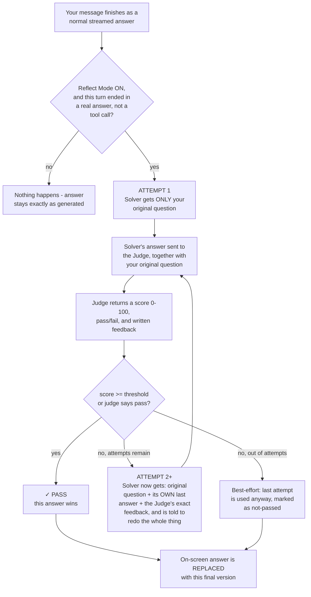

# Reflect Mode - full workflow, injection points, and exact prompts

How the Judge/Solver loop actually works end to end: where every prompt gets built, what text is
literally sent to the model at each step, and how the loop decides when to stop.

---

## 1. The workflow, start to finish



---

## 2. Where it gets injected - the two separate prompt-building paths

This is the part that surprises people: **Reflect Mode does not reuse your normal chat system
prompt, Thinking mode, or Agent Tools.** It builds an entirely separate, self-contained prompt from
scratch for both the Solver and the Judge. Two independent injection points:

```
NORMAL CHAT TURN                          REFLECT MODE (runs AFTER a normal turn finishes)
──────────────────                        ─────────────────────────────────────────────────
systemPrompt (your custom one, if any)    Solver system prompt = your systemPrompt (or a
  + Thinking instructions (if ON)           generic fallback) + a FIXED feedback-handling
  + Agent Tools instructions (if ON)         instruction (see §3) - Thinking/Agent Tools
  → sent via sendChatRequest()               instructions are NEVER added here
    (streaming, tool-call aware)           Judge system prompt = a completely separate,
                                              fixed evaluation prompt (see §4)
                                            → both sent via callLLM() - plain, non-streaming,
                                              no tools, one-shot request/response
```
Consequence: turning Thinking ON does not make the Solver show its reasoning during reflection,
and Agent Tools (`list_dir`/`read_file`/etc.) are completely unavailable to the Solver while it's
reflecting - it can only work from plain text (the question, its last answer, the feedback), never
by looking anything up.

---

## 3. The exact Solver prompt, attempt by attempt

**Attempt 1** - system + one user message:
```
SYSTEM:
<your custom system prompt, or "You are a helpful assistant." if you haven't set one>

IMPORTANT: When given feedback from a judge about your previous answer, carefully address
ALL points raised. Do not ask for clarification - you have everything you need. Just
provide the improved solution directly.

USER:
<your original question, exactly as typed>
```

**Attempt 2 and onward** - same system message, but now THREE messages, always rebuilt from
scratch (not a running conversation history):
```
USER:      <your original question, again - repeated in full every attempt>
ASSISTANT: <the Solver's own previous answer, verbatim>
USER:      JUDGE FEEDBACK (score: <N>/100 - FAIL):
           <the Judge's written feedback from that attempt>

           ---
           Based on this feedback, provide a COMPLETE improved solution. Do not ask
           questions. Address every point the judge raised. Return the full solution
           from scratch with all improvements applied.
```
Why full-context-every-time instead of a growing conversation: so the Solver always has complete,
unambiguous grounding - original question, its own last attempt, and exactly what to fix - with no
risk of it losing track partway through a long back-and-forth.

---

## 4. The exact Judge prompt

Sent fresh every single attempt (the Judge has no memory between attempts either):
```
SYSTEM:
You are a strict solution evaluator. You will receive an original problem/prompt and a
candidate solution.

Evaluate the solution against these criteria:
1. Correctness - Is the solution factually/logically correct?
2. Completeness - Does it address ALL parts of the prompt?
3. Quality - Is it well-structured, clear, and thorough?
4. Edge cases - Does it handle edge cases or potential issues?

You MUST respond with ONLY a JSON object (no markdown, no explanation outside JSON):
{"pass": true/false, "score": 0-100, "feedback": "specific feedback on what's wrong or
could be improved"}

- score >= <your configured threshold> means pass=true
- score < <your configured threshold> means pass=false and you must explain what needs
  fixing in feedback
- Be specific in feedback - say exactly what's missing or wrong so the solver can fix it

USER:
ORIGINAL PROMPT:
<your original question>

CANDIDATE SOLUTION:
<the Solver's answer for this attempt>
```
You can fully replace this prompt (a custom judge prompt field exists in the Reflect settings) -
if you leave it blank, the text above is used verbatim, with `THRESHOLD` swapped for your
configured number.

### Reading the Judge's answer, even when it doesn't cooperate

Models don't always return clean JSON on request, so the response is read in three fallback
attempts, in order:
1. Find a `{...}` object anywhere in the text containing `pass`/`score`/`feedback` and parse it
   directly.
2. No JSON found? Look for patterns like "score: 65" or "65/100" in plain prose, plus a bare
   "pass"/"fail" word search, and reconstruct a verdict from that.
3. Neither worked? Treat the Judge's entire raw reply as the feedback text, and default to
   score 0, fail - it never silently treats an unreadable response as a pass.

---

## 5. Who Solves and who Judges

```
Default:  Solver = your local Ollama model (fast, free, private)
          Judge  = a stronger cloud model (better critic)
```
This split is deliberate, not accidental - let the free local model do the volume work of
attempting an answer, and spend the (usually paid, usually higher-quality) cloud call only on the
one thing that most benefits from a stronger model: judging. Both are independently configurable
to any provider/model you like from the Reflect settings panel - you could just as easily run both
Solver and Judge on the same local model, or flip the split around.

---

## 6. Stopping conditions - exactly how the loop ends

| Condition | What happens |
|---|---|
| Judge scores ≥ threshold (or says `pass:true`) | That attempt's answer wins immediately - loop stops early, doesn't use all attempts |
| Max attempts reached, never passed | The **last** attempt is used anyway (best-effort) - no error shown, just a lower score displayed |
| An attempt errors out (API failure, etc.) | Loop stops immediately, uses whatever the last successful answer was (or a generic error string if there wasn't one) |
| You click Stop Generation mid-loop | The loop is interrupted exactly like a normal streaming answer - nothing is silently swallowed |

## 7. What's kept vs. what's shown

Every attempt (not just the winner) is kept - its answer, its score, its Judge feedback, and
whether it errored - recorded as a full history alongside the final message. On screen, you see
this as a stack of collapsible "Attempt N" cards (only the newest stays expanded as you go), and
a final summary line ("✓ Passed with score 87/100" or "✗ Max iterations reached - best score:
62/100"). The **full** history - every attempt's full text and score - is only visible in full via
**Export Full**; the normal chat view keeps every attempt's card in the transcript but doesn't
surface it anywhere else.
