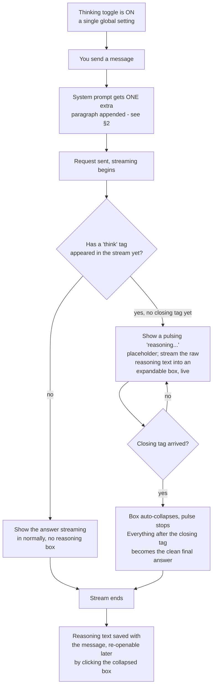

# Thinking Mode - full workflow, injection point, and exact prompt

How chain-of-thought reasoning actually works: where the instruction gets injected, the exact
text sent to the model, and how the live reasoning box is parsed out of the stream as it arrives.

---

## 1. The workflow, start to finish



---

## 2. Where it gets injected

One place only: the system prompt for the **current chat turn**, built fresh every time you send a
message. It is appended (not prepended) after your own custom system prompt, and after nothing
else needs to happen first:

```
sysContent = <your custom system prompt, if you've set one>
           + THINKING_INJECT                (only if the toggle is ON)
           + AGENT_INJECT                   (only if Agent Tools is also ON, unrelated)
```

It does **not** get added to:
- Reflect Mode's Solver prompt (that's a completely separate prompt built from scratch - see
  `REFLECT_WORKFLOW.md` §2) - turning Thinking on has no effect during a reflection loop.
- Any provider's tool-result follow-up messages - the instruction is only in the very first system
  message of a turn, not repeated.

It **does** get re-added on every recursive turn inside an Agent Tools tool-calling loop - each
step of a multi-step agent task gets its own fresh reasoning instruction and its own separate
reasoning box.

---

## 3. The exact prompt text

Appended verbatim, exactly this string, every time the toggle is on:

```
IMPORTANT: Before answering, reason through the problem step-by-step inside <think>...</think>
tags. Show your full reasoning process. Then provide your final answer OUTSIDE the tags.
Example:
<think>
Let me work through this...
Step 1: ...
Step 2: ...
</think>
Your clean final answer here.
```

That's the entire mechanism - there is no model-native "thinking mode" being toggled, no special
API parameter. This is a plain instruction the model is asked to follow, and the app is entirely
responsible for finding and separating out whatever comes back wrapped in those tags. If the model
ignores the instruction (smaller/less steerable models sometimes do), nothing errors - you simply
see a normal answer with no reasoning box, because no `<think>` tag was ever found.

---

## 4. How the live parsing actually works, moment by moment

The app doesn't wait for the stream to finish - it re-checks the **entire accumulated text so far**
after every single incoming chunk:

| State of the buffer right now | What's shown |
|---|---|
| No `<think>` anywhere yet | Just the streaming text so far, as a normal answer (indistinguishable, at this instant, from "the model isn't going to think at all this turn") |
| `<think>` found, no `</think>` yet | A pulsing "reasoning…" box, filled live with everything after `<think>` |
| Both tags found | Reasoning box freezes and collapses; everything after `</think>` (plus anything that came *before* `<think>`, if any) becomes the answer |

Because this re-derives from the full buffer every time rather than tracking state incrementally,
it can't get confused by chunk boundaries landing in the middle of a tag - the check just runs
again on more text than last time.

---

## 5. What happens to it afterward

- **Saved on the message** as its own field, separate from the answer text - switching sessions
  and coming back still shows the collapsed box, re-openable by clicking its header.
- **Rendered as plain text**, not run through the markdown/code-highlighting pipeline the answer
  itself gets - a deliberate simplicity choice, since reasoning traces are usually long and don't
  need formatting.
- **Included in Export Full** as the message's `thinking` field - the only place the raw reasoning
  text is available outside the chat UI itself.
