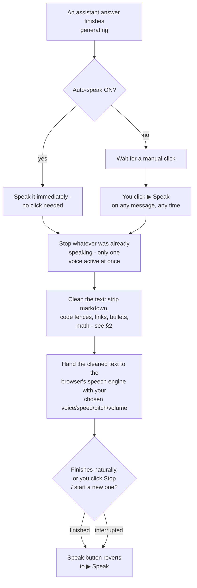

# Text-to-Speech (TTS) - full workflow

How reading answers aloud actually works: what triggers it, what gets cleaned up before it's
spoken, and how it interacts (or doesn't) with the other two features.

Unlike Thinking and Reflect Mode, there's no "prompt injection" here - TTS never talks to the
model. It only ever reads text the model already produced, using your browser's own built-in
voice engine.

---

## 1. The workflow, start to finish



---

## 2. What gets cleaned before speaking

The model's raw markdown answer would sound broken read verbatim ("asterisk asterisk bold asterisk
asterisk"), so it's scrubbed first:

| In the text | Becomes, when spoken |
|---|---|
| ` ```code block``` ` | "code block." |
| `` `inline code` `` | removed entirely |
| `# Heading` | just the heading text, marker stripped |
| `**bold**` / `*italic*` | plain word, formatting marks removed |
| `[link text](url)` | "link text" only - the URL is never read |
| `- bullet` / `1. numbered` | marker stripped, item text kept |
| `\| table \| pipes \|` | pipes replaced with spaces |
| `$$block math$$` | "math equation." |
| `$inline math$` | "equation" |
| Extra blank lines / whitespace | collapsed to single spaces/periods |

This is a fast regex pass, not a real parser - good enough to sound natural, not attempting to be
a perfect markdown-to-speech converter.

---

## 3. The two ways it triggers

**Manual** - click "▶ Speak" under any message, at any time, including old messages from earlier
in the conversation. The button itself becomes "■ Stop" while that message is being read; click it
again to cut it off early.

**Automatic** - turn on the "Auto-speak" toggle once (in the header, or the TTS settings panel),
and from then on every new assistant answer is read the instant it's finalized - no click needed.
This stays on across turns until you turn it off; it's a global setting, not per-message.

Either way, starting a new utterance always stops whatever was already playing first - there is
never more than one voice speaking at once.

---

## 4. Voice, speed, pitch, volume

Pulled from whatever voices your operating system/browser already has installed - nothing is
downloaded or fetched from a server. Voices can take a moment to become available on page load on
some browsers (notably Chrome), which is why the voice list refreshes itself automatically once
the browser reports them ready, rather than assuming they're there immediately. Speed, pitch, and
volume are simple sliders, applied per-utterance from whatever the settings panel currently holds.

---

## 5. How it interacts with the other two workflows

- **Thinking mode**: unaffected either way. Only the final answer text (never the reasoning trace)
  is ever spoken - the reasoning box is not read aloud even if it's expanded on screen.
- **Reflect Mode - the one real gotcha**: Auto-speak fires on the answer the moment it *first*
  finishes generating, which is *before* Reflect Mode has run. If Reflect Mode is also on, it can
  go on to replace that answer with a revised one - but nothing automatically re-speaks the
  revised version. What you hear and what ends up saved/displayed can end up being two different
  answers. To hear the reflected version, click "▶ Speak" again manually once it's done.
- **Agent Tools**: intermediate tool-calling turns are never spoken (they don't count as a
  finalized answer) - only the eventual tool-call-free final answer triggers Auto-speak.

---

## 6. What's persisted

Nothing. TTS is entirely in-the-moment - there's no "was this message spoken" flag saved anywhere,
and it has no representation in Export Full. The only thing that persists across sessions/reloads
is your **settings** (chosen voice, speed, pitch, volume, and whether Auto-speak is on) - the act
of speaking itself leaves no trace on the message or the session data.
