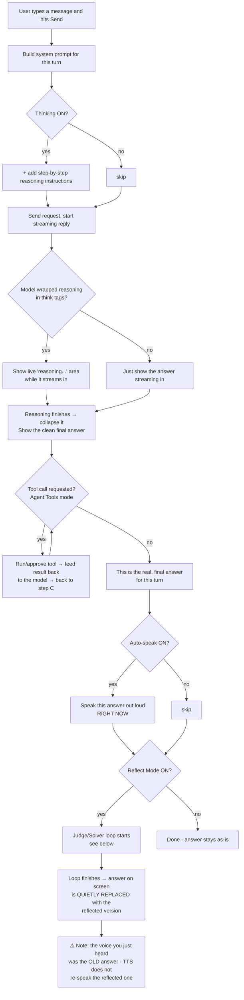
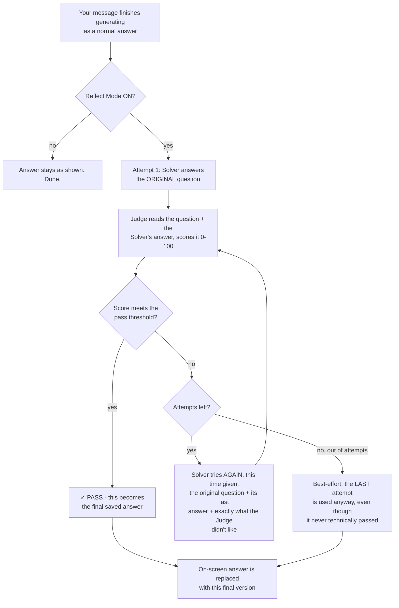

# Gemma Chat - Reflect, Thinking & TTS Workflow

A step-by-step walkthrough of what actually happens, in order, when these three features are in
play - written as a workflow, not a code reference. (For the function-by-function technical
breakdown, see `REFLECT_THINKING_TTS.md`.)

---

## The full journey, one message

**The one thing to remember from this diagram**: Auto-speak and Reflect Mode both react to "the
final answer," but Auto-speak jumps the gun - it reads the answer out loud *before* Reflect Mode
has had a chance to improve it. If you use both together, what you hear and what ends up saved on
screen can be two different answers.

---

## Workflow 1 - Thinking (chain-of-thought)

1. **You flip the "Thinking" toggle on.** This is a global setting - it applies to every chat from
   here on, not just the current one.
2. **You send a message.** Before it goes out, the app quietly adds one extra instruction to the
   system prompt: *"reason step-by-step inside `<think>` tags, then give your clean answer
   outside them."*
3. **The reply starts streaming in.** The app watches the incoming text for a `<think>` tag:
   - If it finds one and there's no closing tag yet → it shows a small pulsing "reasoning…"
     placeholder, and streams the raw reasoning text into an expandable box in real time.
   - If it never finds one → the model just didn't use the convention this turn (or you're
     talking to a smaller model that ignores instructions like this); nothing breaks, you just
     see the normal answer with no reasoning box.
4. **The closing `</think>` tag arrives.** The reasoning box auto-collapses, its pulsing dot stops,
   and the clean answer (everything after the tag) takes over the main message area.
5. **You can re-open the reasoning** at any time by clicking the collapsed box's header - it's
   saved with the message, so it's still there if you switch away and come back.
6. **One thing to know**: this reasoning step happens **fresh, every single turn** - the model
   doesn't remember or build on reasoning from earlier in the conversation, and if you're deep in
   an Agent Tools back-and-forth, each step of that loop gets its own separate reasoning box.

---

## Workflow 2 - Reflect Mode (the Judge/Solver loop)

Think of this as **asking a second opinion before you're shown the final answer** - a Solver
drafts an answer, a Judge grades it, and if it's not good enough, the Solver tries again with the
Judge's notes in hand.

Step by step, in plain terms:

1. **Turn on Reflect Mode** and (optionally) pick which model Solves and which model Judges - by
   default, your local model does the solving (fast, free) and a stronger cloud model does the
   judging (a better critic), but you can point both at whatever you like.
2. **A normal answer finishes generating first** - Reflect Mode only kicks in *after* that, and
   only if the turn didn't end in a tool call (Agent Tools calls skip reflection entirely until
   the tool-calling is done).
3. **Attempt 1**: the Solver answers the original question, from scratch, with no memory of
   anything except your prompt.
4. **The Judge grades it** - a 0–100 score, a pass/fail call, and specific written feedback on
   what's wrong or missing. You can watch this happen live: each attempt appears as its own
   collapsible card in the chat, showing the answer and the Judge's verdict.
5. **Passed?** Done - that answer becomes the final one.
6. **Failed, and attempts remain?** The Solver tries again - this time it's shown the *original
   question*, its *own previous answer*, and the *Judge's exact feedback*, and is told to produce
   a complete corrected answer (not a patch, a full redo).
7. **Repeat** up to the configured max attempts (5 by default).
8. **Ran out of attempts without passing?** No panic, no error shown - the last attempt is simply
   used as the final answer, along with its (failing) score, so you can see how close it got.
9. **Whichever answer wins**, it silently replaces what was on screen a moment ago - the
   pre-reflection draft is gone from view (though every attempt's full text and score is kept
   behind the scenes - that's what the "Export Full" option pulls out).
10. **Want to stop mid-loop?** Hitting Stop Generation interrupts a reflection loop exactly the
    same way it interrupts a normal streaming answer.

---

## Workflow 3 - Text-to-Speech (TTS)

1. **Pick a voice, speed, pitch, and volume** in the TTS settings panel - this uses whatever
   voices your browser/OS already has installed; nothing is downloaded.
2. **Two ways to trigger speech:**
   - **Manual**: click "▶ Speak" under any message, any time, even an old one.
   - **Automatic**: turn on "Auto-speak" once, and every new assistant answer is read aloud the
     moment it finishes generating - no click needed.
3. **Before speaking**, the text is cleaned up so it doesn't sound like you're reading raw
   markdown out loud - code blocks become "code block," `**bold**`/`*italic*` markers are
   stripped down to the plain words, links read as just their text, bullet/number markers
   disappear, math blocks become "math equation."
4. **Only one voice at a time** - starting a new one (manual or automatic) immediately stops
   whatever was already playing.
5. **Stopping**: click the same button again (it turns into "■ Stop" while speaking), or start
   speaking something else.
6. **The timing gotcha**: if Auto-speak *and* Reflect Mode are both on, Auto-speak reads the
   answer the instant it first finishes - which is *before* Reflect Mode has run. If Reflect Mode
   later changes the answer, you won't hear the updated version automatically; you'd need to click
   "▶ Speak" again on the now-updated message to hear the final one.

---

## Where this ends up in an export

If you use **Export Full** on a chat, every workflow above leaves a trace:
- Thinking → each message's saved reasoning text.
- Reflect Mode → every attempt (not just the winner), with each attempt's answer, score, and
  Judge feedback.
- TTS → nothing - it's a one-time, in-the-moment action and isn't recorded on the message itself.
